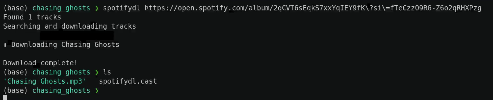

 
<h1 align="center">Spotifydl</h1>
<h4 align="center">A Music Downloader for Spotify</h4>

----



Spotifydl is a spotify media downloader.

It uses Youtube as the audio source and Spotify API for playlist/album/track details.

## Installation

### From Source

#### Prerequisites

- [youtube-dl](http://ytdl-org.github.io/youtube-dl/download.html)
- [ffmpeg](https://ffmpeg.org/download.html)

Make sure you have golang, youtube-dl and ffmpeg installed.
```bash
go get github.com/BharatKalluri/spotifydl
```


## Usage

```bash
spotifydl https://open.spotify.com/album/2qCVT6sEqkS7xxYqIEY9fK?si=9QGOHnUrQb27Fb3dNY_Rlw
# The album has been downloaded, tagged and converted to mp3!
```

If there are any Improvements or corrections that can be made, feel free to open an issue.

Note: This project was only done for as a learning experience for academic purposes. Usage of this product is up to the user and no responsibility will be taken for the user's action using this software.
